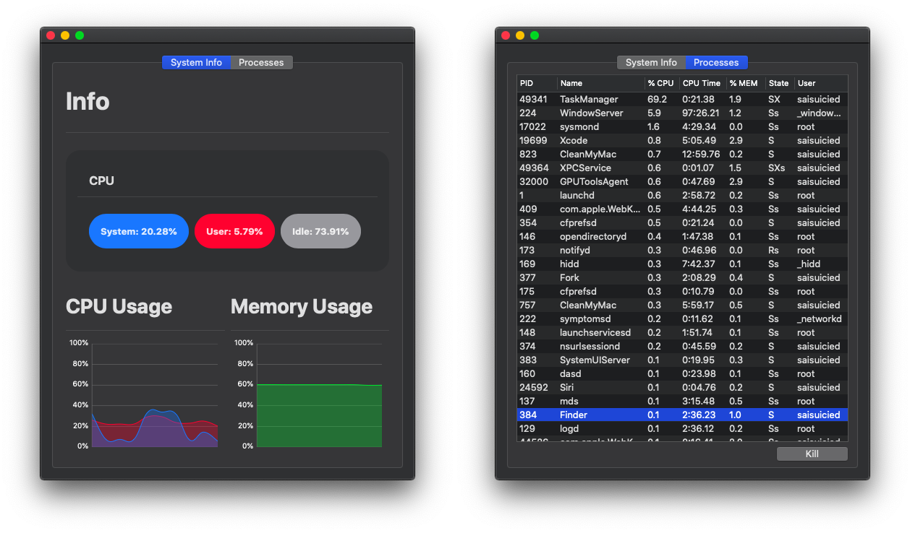

# TaskManager

## Постановка задачи

Написать менеджер процессов для macOS, который будет иметь следующие функциональные возможности:

* общие сведенья о доступных ресурсах системы и их потреблении

* графическое отображение ресурсов потребляемых системой

* отображение работающих системных процессов

* управление этими процессами

## Что должно получится 

Нативное приложение для macOS функционально покрывающие все требования поставленные в задаче.

## Что получилось

### Фичи

* написаны сервисы для получения системной информации

* написаны сервисы для получения информации о текущих процесах системы

* возможность "убивать" процессы

* написан UI с использование нового декларативного фреймворка `SwiftUI `

### Интерфейс

### Использование

