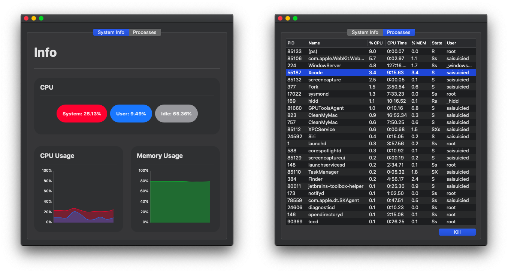
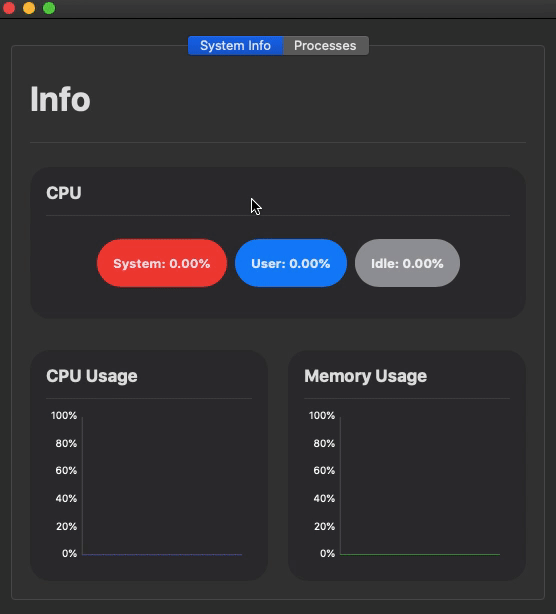

# TaskManager

## Features 

* UI of application fully written in `SwiftUI`
* Gains system information by parsing `ps` and `top` commands (`XPCService` is using for that)
* You can kill a process (be careful with this). This feature is `kill -9` under the hood
* You can kill a process by pressing `Enter`

## Screenshots

## Usage

